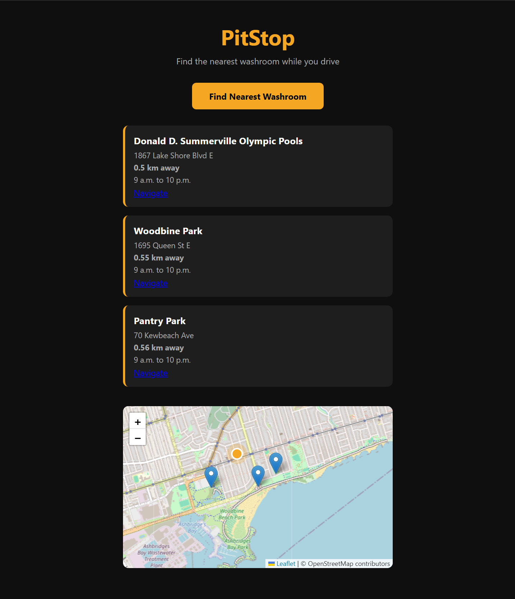

# PitStop 

**A full-stack web app that helps Toronto rideshare drivers find the 3 nearest open washrooms from their current GPS location — in one tap.**

🔗 **Live demo:** https://pitstop-production-f23c.up.railway.app/app



---

## The problem

I drove rideshare in Toronto for about 20 months, and finding a washroom quickly while on the road was a constant problem. Many places don't let drivers in, some are closed, and existing map apps take too many taps when you're in a hurry. PitStop is built around that specific pain point: minimal interaction, fast answer, only places that are actually open right now.

---

## Features

- **One-tap search** — uses the browser's geolocation to find your position, no typing.
- **3 nearest washrooms** — ranked by real distance, not just whatever is on screen.
- **Open-now filtering** — closed locations are hidden so you don't drive to a locked door.
- **Interactive map** — pins rendered with Leaflet.js.
- **One-tap navigation** — each result links straight into Google Maps directions.
- **877 real Toronto locations** — sourced and merged from two public datasets (see below).

---

## Tech stack

| Layer | Technology |
|---|---|
| Backend | FastAPI (Python) |
| Database | PostgreSQL (hosted on Railway) |
| Frontend | HTML / CSS / JavaScript, Leaflet.js |
| Distance | Haversine formula (custom implementation) |
| Containerization | Docker + docker-compose |
| Deployment | Railway |
| Data | OpenStreetMap Overpass API, Toronto Open Data (CKAN API) |

---

## How it works

1. The browser sends the user's GPS coordinates to the backend.
2. A **bounding-box pre-filter** narrows the ~877 locations down to a small candidate set near the user, so the app isn't running an expensive distance calculation on every row.
3. The **Haversine formula** computes the real great-circle distance to each candidate.
4. Opening hours are parsed and closed locations are dropped.
5. The API returns the **3 closest open washrooms**, which the frontend drops onto the map with navigation links.

### API endpoints

| Method | Endpoint | Purpose |
|---|---|---|
| `GET` | `/` | Health check |
| `GET` | `/app` | Serves the frontend |
| `GET` | `/washrooms` | Returns all locations |
| `POST` | `/find-washroom` | Takes GPS coordinates, returns the 3 closest open washrooms |
| `POST` | `/washrooms` | Adds a new washroom location |

---

## Technical highlights

These were the parts that taught me the most:

- **Migrated the database from SQLite to PostgreSQL.** This surfaced real differences between the two — `INSERT OR IGNORE` (SQLite) became `ON CONFLICT DO NOTHING` (PostgreSQL), placeholders changed from `?` to `%s` with psycopg3, and failed transactions have to be explicitly rolled back before the connection can be reused.
- **Merged two independent data sources into one clean dataset.** 518 locations from the OpenStreetMap Overpass API and 355 official public washrooms from Toronto Open Data, deduplicated down to 877 using a `UNIQUE(latitude, longitude)` constraint so the same spot can't be inserted twice.
- **Added a bounding-box pre-filter before distance calculation** to avoid computing Haversine distance against every location on every request.
- **Fixed a production-only bug from hardcoded `localhost` URLs.** The frontend originally called `http://localhost:8000`, which broke on mobile because `localhost` resolves to the phone itself. Switching to relative URLs (`/find-washroom`) made the same code work in both local development and production.
- **Kept credentials out of the repo** using environment variables and a gitignored compose file.

---

## Running it locally

```bash
# Clone the repo
git clone https://github.com/DBakibaba/pitstop.git
cd pitstop

# Set your database URL in a .env file
# DATABASE_URL=postgresql://...

# Start with Docker
docker-compose up --build
```

The app will be available at `http://localhost:8000/app`.

> Note: `load_dotenv()` is called before any database import so `DATABASE_URL` is set correctly in local development.

---

## Data sources

- [OpenStreetMap](https://www.openstreetmap.org/) via the Overpass API
- [City of Toronto Open Data](https://open.toronto.ca/) (public washroom dataset)

Data is used for a non-commercial portfolio project; credit to both sources.

---

## Possible next steps

- User-submitted locations with photo verification
- Parking-difficulty indicator per location
- Caching frequent queries
